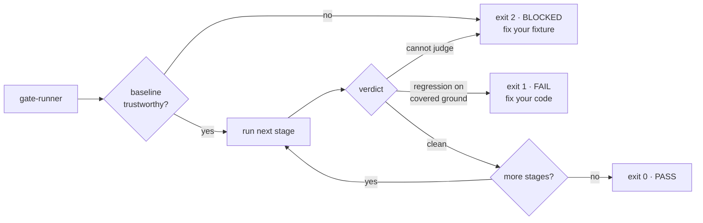

# agentic-claude

A Claude Code plugin that proves a change didn't break anything — executable gates and frozen
baselines, checked by scripts with exit codes, instead of a checklist asking an agent whether it went
okay.

## The problem

Three things that happen in real repositories:

- Your test runner **crashed on startup**. Zero tests failed. The check passed.
- You ran `git add` on a file that still contained `<<<<<<<`. Git cleared its conflict status without
  a word, and `git status` went clean.
- Your visual baseline was captured **while logged out**, so every page is the login screen. Everything
  matches. It is comparing nothing.

Each of these is a *silent pass* — and a silent pass is indistinguishable from success. That is the
entire problem this repo exists to attack.

## What it looks like

A gate chain that caught the first one:

```text
[chain] baseline validated, 0.0h old
[secrets] PASS (scanned=5 findings=0)
[unit] BLOCKED: run produced zero results — the runner almost certainly failed to start,
       and "no failures" from an empty run is not a pass
  This gate could not judge the change. That is not a pass.
[chain] halted at "unit" (BLOCKED). Later stages did not run.
```

Most tooling has two outcomes, so "I don't know" has to be encoded as one of them — and it is almost
always encoded as pass. There are three here:

| Exit | Verdict | Means |
|---|---|---|
| `0` | PASS | Compared something real, found no unexplained difference. |
| `1` | FAIL | A regression on ground the baseline covers. **Fix your code.** |
| `2` | BLOCKED | The gate could not form an opinion. **Fix your fixture.** |

> [!NOTE]
> The distinction is operational, not philosophical. Exit `1` sends someone to the diff. Exit `2` sends
> them to the baseline, the runner, or the capture. Collapsing them lets a broken fixture collect green
> checkmarks indefinitely.



An honest pass says what it *didn't* check:

```text
[integration] PASS (observed=5 baseline=4 blocking=0 explained=0 uncovered=1)
  reported  cart.shippingCost has no baseline entry — no baseline coverage for this key
```

## Install

```
/plugin marketplace add https://github.com/toxiccoder777/agentic-claude
/plugin install agentic-claude@agentic-claude
```

Or from a local clone:

```
/plugin marketplace add /path/to/agentic-claude
/plugin install agentic-claude@agentic-claude
```

> [!NOTE]
> Requires Node 18 or newer. No dependencies — every script uses only the Node standard library.
> Developed and tested on Node 22.

## What's here

The pieces are meant to compose — a risky change runs the length of this:

```text
plan-migration → baseline → change → verify-gate → merge → review-diff
                    │                     │           │
          baseline-capture    verification-gate    merge-conflict-resolution
          is it                is anything          did the merge
          deterministic?       broken?              stay in scope?
```

| | Count | |
|---|---|---|
| **Skills** | 4 | verification gates, database migration, baseline capture, merge conflicts |
| **Agents** | 7 | orchestration, planning, auditing, review, security, git |
| **Commands** | 8 | thin wrappers over the agents, plus scaffolding |
| **Hooks** | 2 | surface an unfinished gate chain across restarts and compaction |

### Skills

| Skill | What it's for |
|---|---|
| [`verification-gate`](skills/verification-gate/) | Six executable gates with frozen baselines, coverage-aware pass/fail, and a resumable stage machine. |
| [`db-migration`](skills/db-migration/) | Cloning, exhaustive schema diffing, atomic execution, and auditing inherited SQL before running it. |
| [`baseline-capture`](skills/baseline-capture/) | Proves a capture script is deterministic by running it twice and diffing — not by eyeballing it. |
| [`merge-conflict-resolution`](skills/merge-conflict-resolution/) | Proves a conflict resolution stayed in scope, kept both sides, and never touched the index. |

### Agents

| Agent | What it does |
|---|---|
| `verification-orchestrator` | Runs the gate chain and reads the result; never reports BLOCKED as passing. |
| `migration-planner` | Breaks a modernization into hops, each with a gate that would falsify it. |
| `baseline-auditor` | Judges whether a baseline is trustworthy before it gets frozen. |
| `db-migration-auditor` | Triages inherited SQL for destructive operations, then classifies each script. |
| `code-reviewer` | Fresh-context correctness review — no memory of *why*, only what the diff does. |
| `security-scanner` | Mechanical secret scan, then a judgment-based OWASP pass. |
| `git-pilot` | Resolves merge/rebase conflicts from all three stages, then stops. Never stages or commits. |

### Commands

| Command | Runs |
|---|---|
| `/verify-gate [path]` | The gate chain via `verification-orchestrator` |
| `/gate-resume [path]` | A resume, after checking nothing changed earlier in the chain |
| `/plan-migration <what>` | `migration-planner` to design verifiable hops |
| `/review-diff [scope]` | `code-reviewer` on the current diff |
| `/db-audit <folder>` | `db-migration-auditor` on a folder of legacy SQL |
| `/secret-scan [path]` | The secrets gate standalone |
| `/resolve-conflicts [path]` | `git-pilot` on a conflicted repo |
| `/skill-new <name>` | Scaffolds a skill — refuses if it can't meet the bar below |

Two runnable demos, both dependency-free:
[`verification-gate-demo`](examples/verification-gate-demo/) (ten scenarios, including the ones
designed to fail) and [`merge-conflict-demo`](examples/merge-conflict-demo/) (six conflicts covering
`UU`, `AA` and `DU`, plus binary and whitespace-only cases). The latter also ships
`run-checks.mjs`, which asserts the verifiers' exit codes against generated fixtures.

## Philosophy

Most skill collections optimize for breadth: hundreds of markdown files telling an agent which
commands to type. That has a failure mode — **an instruction is not an enforcement mechanism.** "STOP
and fix this" in a markdown file is a suggestion, and an agent that has just spent twenty minutes on a
change it believes is correct is very good at talking itself past a suggestion.

Every skill here has to answer two questions:

1. **What does it enforce?** Not what it advises — what fails, loudly, when the rule is broken?
2. **How would you verify it worked?** "The agent says it did" is not an answer.

| | Prose checklist | This repo |
|---|---|---|
| Form | Markdown telling an agent what to run | Scripts with process exit codes |
| Enforcement | The agent's compliance | A runner that refuses to advance |
| Reference | Whatever the suite says right now | A committed baseline, plus a report vouching for it |
| Empty run | Reads as clean | BLOCKED — an empty scan is not a clean scan |
| Partial coverage | Fails everything, then gets disabled | Covered blocks; uncovered reports, and says so |
| Flaky spec | Quarantine on first red | pass@k separates flaky from broken |

One honest exception: **`db-migration` ships no scripts.** It is procedural guidance, and by the strict
reading of the table above it is the very thing the left column describes. It stays because what it
enforces is enforced by Postgres rather than by Node — a migration assembled as one script and run
under `psql -v ON_ERROR_STOP=1 -1` either lands whole or rolls back, and the skill's substance is the
sequencing and diffing discipline that gets you to that point. Worth naming rather than letting the
table imply four-for-four.

Corollaries, each of which cost a real bug to learn:

- **Silence is not success.** A crashed runner and a perfect run produce the same "no failures found".
- **Coverage-aware, not binary.** A gate that hard-fails on ground it has no baseline for gets switched
  off within a week, and a switched-off gate has a 100% false-negative rate.
- **The baseline itself can be broken**, and nothing else checks it.

The long version is in [docs/architecture.md](docs/architecture.md).

## Deliberately not built

A framework-hop-migration skill and a legacy-API-modernization skill were both designed and then cut —
they would have restated what `migration-planner` and `verification-gate` already do, which
[CONTRIBUTING.md](CONTRIBUTING.md) calls a references-doc case, not a new skill. A mobile skill was cut
too: there's no real mobile experience behind this repo, and a skill that can't draw on any is worse
than no skill.

The bar is the two questions above. It is meant to be load-bearing, and it is easier to trust a bar
that visibly rejects things.

## Contributing

See [CONTRIBUTING.md](CONTRIBUTING.md). Version history is in [CHANGELOG.md](CHANGELOG.md).

## License

MIT — see [LICENSE](LICENSE). All content here is original work.
